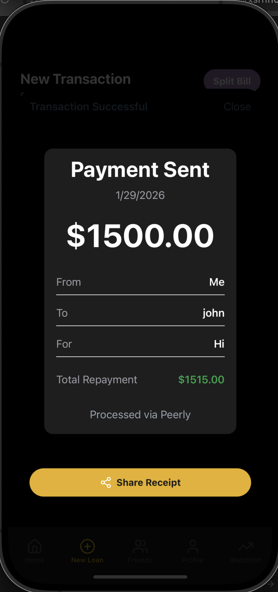
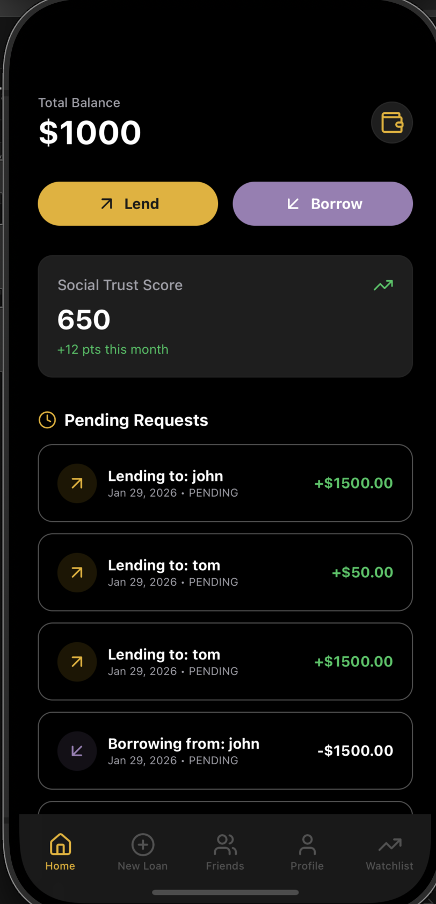
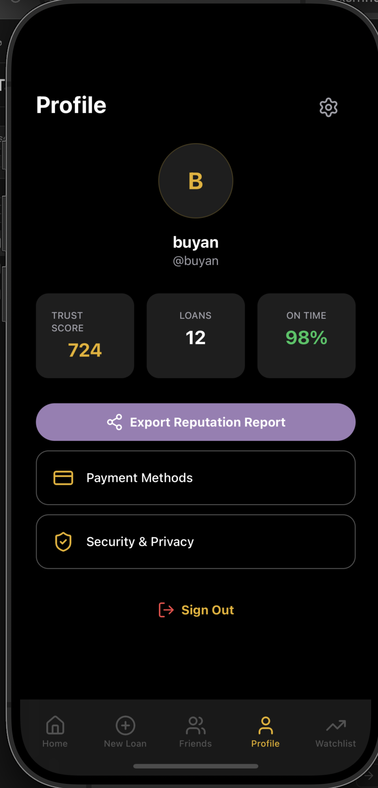

# Peerly App

A React Native mobile application built with Expo, NativeWind, and Supabase for tracking social loans and expenses.

## Screenshots

<p align="center">
  
  
  
</p>

## Features

- **Social Loans**: Easily track money lent or borrowed from friends.
- **Trust Score**: Gamified social credit score based on repayment history.
- **Split Bill**: (Coming Soon) Split expenses with groups.
- **Activity Log**: Keep a history of all your transactions.

## Prerequisites

- Node.js (v18 or newer)
- npm or yarn
- Expo Go app on your mobile device (optional, for physical device testing)
- iOS Simulator (Mac only) or Android Emulator

## Configuration

1. Copy the example environment file:
   ```bash
   cp .env.example .env
   ```

2. Open `.env` and fill in your Supabase credentials:
   ```env
   EXPO_PUBLIC_SUPABASE_URL=your_project_url
   EXPO_PUBLIC_SUPABASE_ANON_KEY=your_anon_key
   ```

## Getting Started

1. Install dependencies:
   ```bash
   npm install
   ```

2. Start the development server:
   ```bash
   npx expo start
   ```

## Running the App

- **Press `i`** in the terminal to open in the **iOS Simulator**.
- **Press `a`** in the terminal to open in the **Android Emulator**.
- **Scan the QR code** with your phone's camera (iOS) or Expo Go app (Android) to run on a physical device.

## Tech Stack

- **Framework**: React Native (Expo)
- **Styling**: NativeWind (Tailwind CSS)
- **Navigation**: Expo Router
- **Backend**: Supabase
- **Icons**: Lucide React Native
